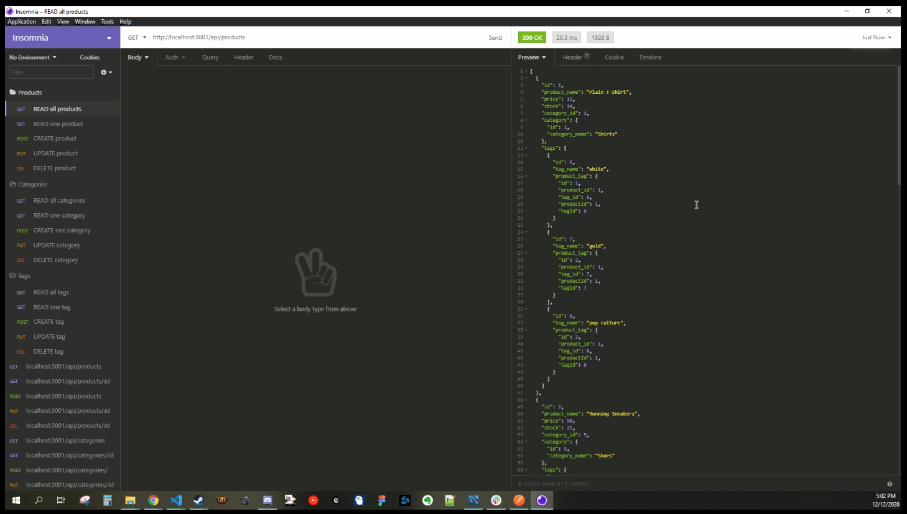

# E-Commerce Back-end

## Description

This is a C.L.I. that interacts with a ecommerce mySQL database. The application allows you to retrieve, add, update, and delete items from a database for an inventory management system.

## Table of Contents

-   [Installation Instructions](#installation-instructions)
-   [Usage Information](#usage-information)
-   [License](#license)
-   [Contribution Guidelines](#contribution-guidelines)
-   [Test Instructions](#test-instructions)
-   [Questions](#questions)

## Installation Instructions

This application requires Node.js which can be downloaded <a href="https://nodejs.org/en/" target="_blank">here</a>. It utilizes a few node modules called <a href="https://expressjs.com/" target="_blank"> express</a>, <a href="https://sequelize.org/" target="_blank"> sequelize</a>, <a href="https://www.npmjs.com/package/dotenv" target="_blank"> dotenv</a>, and <a href="https://www.npmjs.com/package/mysql2" target="_blank"> mysql2</a>. All packages can be installed using <a href="https://www.npmjs.com/" target="_blank">node package manager</a>. This requires a local or remote mySQL server to be running for database storage, the database can be populated with command "npm run seed" after it is created. Simply run "npm install" in the root directory to install all dependencies.

## Usage Information

This app can be used to manage a mySQL database based on an ecommerce inventory management layout. Using the program is as easy as running "npm start" or "node server" after you have the database seeded via the installation instructions. Once the server is running you may use a front-end to send request to the server or use an application such as <a href="https://www.postman.com/" target="_blank"> postman</a> or <a href="https://insomnia.rest/products/core/" target="_blank"> Insomnia Core</a>.

Click the image below to view the demo video!

## License

This project is not utilizing a license

## Contribution Guidelines

This is a fully open source project, you may fork the repository and any pull requests will be viewed and implemented accordingly.

## Test Instructions

There are no test scripts setup for this program currently.

## Questions

If there are further questions please contact me with the following.

 AndrewMorrow - <a href="https://github.com/AndrewMorrow" target= "_blank">Github</a>

Email: beardedmongo@gmail.com
